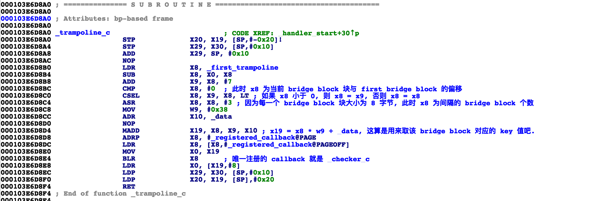

## Prologue

hooking `objc_msgSend` will crash if enable `MainThreadChecker`.

由于 `HookZz` 和 `frida-gum`, 在进行 `PostCall` 的 hook 设置时, 会修改 `x30(lr)`, 因而在之后的 `_dyld_image_header_containing_address` 以及 `_dyld_image_header_containing_address` 都不会有正确的值.
